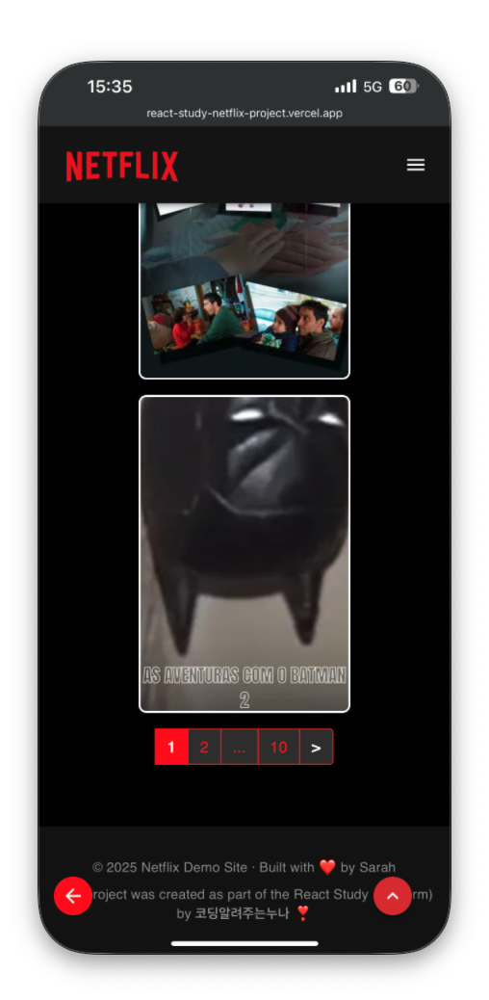

🎬 Netflix Demo Site (React Study 3rd)

코딩알려주는누나(코알누) 리액트 스터디 3기 과제로 제작한 넷플릭스 클론 프로젝트입니다.
영화 검색과 예고편 감상, 정렬, 필터 등의 다양한 기능을 통해 TMDB API를 기반으로 유저 친화적인 영화 탐색 경험을 제공합니다.

🔗 배포된 사이트 보러가기

📌 주요 기능

🔍 키워드 기반 영화 검색 (TMDB Open API 활용)

🎭 장르별 필터링 (다중 선택 가능)

🔽 인기순, 평점순, 투표수순 등 6가지 정렬 옵션 지원

📺 예고편 YouTube 모달 재생 기능

🖼️ 포스터 이미지 오류 시 대체 이미지 표시

⏫ 스크롤 탑 버튼, 🔙 뒤로가기 버튼

📱 반응형 디자인 (모바일 ~ 데스크탑 대응)

🛠️ 사용 기술

React 18 + Vite

React Router v6

Zustand - 상태 관리

TanStack React Query - API 데이터 fetching 및 캐싱

Axios - API 유틸 함수화하여 통신 모듈화

Material UI (MUI) - UI 컴포넌트

React Bootstrap - 일부 UI 레이아웃 정렬 보조

TMDB API - 영화/장르/예고편 등 데이터 활용

Vercel - 정적 배포 플랫폼

## 📂 폴더 구조

```
├── public
│   ├── favicon.ico
│   ├── placeholder.png
│   └── placeholder-banner.png
├── src
│   ├── assets              # 이미지 등 에셋 파일
│   ├── common              # 공통 UI 컴포넌트
│   ├── constants           # 장르 아이디 등 상수
│   ├── hooks               # 커스텀 훅 (useSearchMovie, useTrailer 등)
│   ├── layout              # AppLayout, Footer 등 전역 UI
│   ├── pages               # MoviePage, DetailPage 등 라우트 페이지
│   ├── store               # Zustand 전역 상태 관리
│   ├── utils               # Axios 설정 등 유틸 함수
│   ├── App.jsx             # 메인 컴포넌트
│   ├── main.jsx            # 앱 진입점
│   ├── App.css / index.css
├── .env                    # TMDB API 키 보관
├── vite.config.js          # Vite 설정
├── README.md
```

⚡ 프로젝트 진행 중 어려웠던 점 & 해결 방법

🔸 1. TMDB API 파라미터 관리

sort_by, with_genres, query 등의 파라미터 조합이 복잡해서 원하는 결과가 안 나올 때가 많았음

🔧 커스텀 훅으로 분리하고 useQuery의 queryKey를 객체 기반으로 구성해 관리의 일관성을 유지함

🔸 2. 이미지 로딩 실패 시 대체 이미지 적용

포스터 이미지가 없는 경우 UI가 무너짐 → onError 핸들러를 활용해 대체 이미지 placeholder.png 사용

🔸 3. 예고편 트레일러 모달 구현

처음에는 새 창으로 링크 연결했으나, UX 개선을 위해 MUI Modal과 YouTube embed로 변경함

🔸 4. 필터/정렬 변경 시 URL과 상태 싱크 유지

React Router의 useSearchParams를 활용해 URL 쿼리 기반으로 정렬 상태 유지 및 뒤로가기 작동 해결

🔸 5. 반응형 대응 및 카드 호버 스타일

카드 스타일이 디바이스에 따라 깨지는 문제가 발생 → MUI의 Grid 시스템과 media query로 조정함

## 📷 대표 스크린샷

### 🖥️ 웹 버전

| 홈                           | 무비 페이지                                        | 디테일: 예고편                             | 디테일: 리뷰                             |
| ---------------------------- | -------------------------------------------------- | ------------------------------------------ | ---------------------------------------- |
|  |  |  |  |

### 📱 모바일 버전

| 홈1                             | 홈2                             | 무비1                            | 무비2                            | 디테일1                           | 디테일2                           | 디테일3                           |
| ------------------------------- | ------------------------------- | -------------------------------- | -------------------------------- | --------------------------------- | --------------------------------- | --------------------------------- |
|  |  |  |  |  |  |  |

📜 저작권 및 감사

본 프로젝트는 **코딩알려주는누나(코알누)**의 리액트 스터디 3기를 통해 학습한 내용을 바탕으로 제작되었습니다.

영화 및 이미지 데이터는 TMDB (The Movie Database)에서 제공받았습니다.

💖 Built with React & Vite | Powered by 코딩알려주는누나
